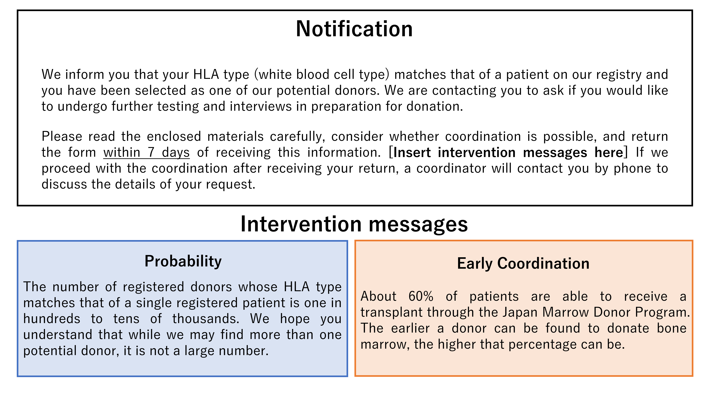

```{r include=FALSE}
knitr::opts_chunk$set(
  echo = FALSE,
  warning = FALSE,
  error = FALSE,
  message = FALSE,
  dev = "pdf",
  fig.width = 15,
  fig.height = 10,
  fig.pos = "t",
  out.extra = ""
)
```

```{r option, include = FALSE}
options(
  knitr.table.format = "latex",
  knitr.kable.NA = "",
  kableExtra.auto_format = FALSE
)
```

# Introduction {#intro}

Allogeneic hematopoietic stem cell transplantation (HSCT) is one of the treatments with the lowest relapse rates for leukemia and other blood diseases. In this treatment, (1) anticancer drugs and radiation simultaneously kill tumor cells and healthy hematopoietic stem cells, and (2) healthy hematopoietic stem cells donated by others are transplanted. Transplantation requires that the donor's white blood cell type, called HLA, match the patient's HLA.[^hapro] Whereas the probability of a match between two randomly selected individuals is less than 1%, the probability of a match between siblings is the highest at approximately 30%. The probability of a match between parents and their children is also low.

If there is no match among relatives, patients must seek a nonrelative donor. In Japan, patients typically seek nonrelative donors through the Japan Marrow Donor Program (JMDP). However, coordination through the JMDP is a slow process and only 60% of registered patients receive transplants [@Hirakawa2018]. Therefore, it is important to shorten the time to transplantation and increase the transplantation rate in registered patients.

[^hapro]: In recent years, transplantation between close relatives with semi-matched HLA, known as haploidentical stem cell transplantation, has become increasingly common. In addition, the transplantation of blood cells from the umbilical cord or placenta that connects mother and child (cord blood transplantation) has also increased. Unlike bone marrow transplantation, cord blood transplantation can be performed even if the HLA is not a perfect match. In Japan, bone marrow (or peripheral blood) transplants between unrelated individuals, accounted for 20% of all transplants performed in FY2021 [@JapaneseDataCenterf2022].

To increase transplantation rates, one possible intervention involves increasing the proportion of potential donors willing to donate and improving the quality of the donor pool.[^pool-size] @Hirakawa2018 found that many transplantation coordinations (56% of those conducted in 2004--2013) were interrupted before the first step in the process - confirmatory typing - for donor-related reasons. The reasons related to donors include unhealthy conditions, but also a lack of motivation. Because physicians of patients select the optimal one from matched donors who reach the confirmatory typing, attrition before the confirmatory typing reduces the availability of donors. This problem is not only for JMDP but also for Marrow Donor Programs in other countries [@Haylock2024]. Therefore, interventions that aim to increase donors' willingness to donate and prevent attrition before the confirmatory typing are effective and important.

[^pool-size]: Another possible intervention includes increasing the number of potential donors to increase the probability of a match. However, according to @Takanashi2016, even though the number of potential donors nearly doubled between 2000 and 2015, the probability of a first-time match increased by only 5%. This is because new donors are unlikely to have a rare HLW type. The marginal benefit of increasing the number of potential donors is small.

<!-- Especially, younger donors are less likely to interrupt coordination for health reasons and are more likely to interrupt coordination for other personal reasons, such as a lack of motivation.[^detail-result] Given the better transplant outcomes for younger males than for patients of other genders and ages [for example, @Kollman2016], it is also important to find interventions that can particularly increase the willingness to donate among young male donors through heterogeneous analysis.

[^detail-result]: While 15% of males in their 20s were suspended due to donor health (history, back pain, undergoing treatment, etc.), 41% were suspended for reasons other than donor health (inability to contact, unavailability, etc.). In addition, 6% were interrupted due to lack of family consent, a prerequisite for transplantation. The remaining coordinations were either suspended due to patients or reached transplantation. -->

Interventions that can increase the willingness of young male donors with good transplant outcomes are the most important. @Kollman2016 revealed that the older the donor is, the higher the mortality risk is. Furthermore, they also found that female donors who have given birth increase the risk of the representative complication of HSCT, GVHD, compared to male donors. @Loren2006 discovered a similar trend and further revealed that transplants from female donors to male patients, regardless of childbirth experience, increase the risk of GVHD compared to transplants from male donors to male patients. This gender mismatches resulting in increased prognosis risks have also been confirmed in Japan [@Nannya2011]. These studies suggest that young male donors have better transplant outcomes, but males in their 20s are more likely to interrupt coordination due to personal reasons such as lack of motivation [@Hirakawa2018]. Based on these motivations, we need to estimate the intervention effects for male donors in their 20s.

Whether a policy that uniformly assigns the intervention most effective for males in their 20s, regardless of gender and age, is preferable depends on the intervention effects for other gender and age groups. If the intervention has negative effects for gender and age groups other than males in their 20s, it would be better to implement the intervention only for males in their 20s (targeting policy). Otherwise, it should be fine to implement the intervention most effective for males in their 20s to everyone. To examine the appropriateness of a targeting policy, we need to estimate the effects not only for males in their 20s but also for other gender and age subgroups.

This study examines the effect of providing information that increases willingness to donate as a measure to improve the quality of the donor pool. When a potential donor registered with the JMDP is matched to a specific patient, the matched donor receives a compatibility notice from the JMDP. Matched donors who respond to the notice by indicating their willingness to donate are then coordinated for transplantation. We added two new messages to the compatibility notice based on information published by the JMDP. In collaboration with JMDP, we conducted a field experiment with 11,154 matched donors who received compatibility notices between September 2021 and February 2022.

The first message (*probability* messeage) informs the matched donor that the number of HLA-compatible donors per patient is low. If there are other potential donors with the same HLA type in the pool, compatible donations are interchangeable. Thus, transplantation through JMDP is a public good and faces a standard "free-ride" problem [@Bergstrom2009]. However, potential donors in the JMDP do not know their own HLA type. Consequently, if potential donors gain utility from patient's survival and overestimate the number of possible substitutes, they may be reluctant to donate. The first message aims to correct the behavior resulting from this misperception.

The second message (*early coordination* message) informs the matched donor that early coordination would increase a patient's transplant rate. This message is intended to prevent time-inconsistent donors from delaying their response to the compatibility notice. Time inconsistency is caused by present bias, a key finding in behavioral economics [@Laibson1997; @ODonoghue2001].[^def-pbias] Time-inconsistent donors delay responding even if they believe that they should respond immediately. The second message indicates that the utility of transplantation decreases over time (regardless of the individual's time preference) and aims to prevent delayed responses.

[^def-pbias]: Present bias is a phenomenon in which the time discount rate decreases over time. This can cause people to choose low current benefits even if they believe in advance that high future benefits are desirable.

<!-- Four experimental arms were created to test the effects of the above messages. The first experimental arm sent a compatibility notice without the above two messages to the matched donors (control group). The second and third experimental arms added one of the above messages to the compatibility notice. In the fourth experimental arm, both messages were added to the compatibility notice.[^arm-aim] We conducted a field experiment with 11,154 matched donors who received compatibility notices between September 2021 and February 2022. We employed weekly cluster randomization. We received coordination data at the end of June 2022, in collaboration with JMDP, to test the effects of the messages.

[^arm-aim]: This experimental arm is designed to test the hypothesis that the simultaneous addition of two intervention messages may cause the matched donor to receive excessive information and suffer from cognitive overload. -->

We received the coordination data at the end of June 2022 and verified the effects of the messages. Our primary outcomes are the response to the compatibility notice, which strongly reflects the donor's willingness, and reaching the confirmatory typing, which represents the donor's availability.[^data-detail] First, we estimate the overall average effect of the two messages. Next, we divide the sample by gender and age groups and estimate the effect for each group. Even if the overall average intervention effect is positive, the effect for young male donors with good transplant outcomes may be negative. Conversely, the intervention most effective for young male donors may have negative impacts on other gender and age groups. In such cases, that intervention should only be implemented for young male donors. These possibilities motivate us to examine the heterogeneity of the message effects.

[^data-detail]: Regarding the response to the compatibility notice, the data records the donor's willingness to donate and the time it takes to respond.

The experimental results show that the probability message increases the probability of reaching the confirmatory typing, contributing to the availability of donors. Furthermore, the probability message increases the willingness of young male donors, who have good transplant outcomes, and also increases their probability of reaching the confirmatory typing. At the same time, the probability message does not have a negative impact on other gender and age groups, so there is no downside to uniformly assigning the probability message.

Another finding is that the early coordination message does not affect the overall response rate for females in their 20s but does increase responses within four days of sending the compatibility notice.[^goal-day] In other words, this information shortens the number of days donors take to respond rather than encouraging response behavior itself. This effect is not observed in the other genders or age groups.

[^goal-day]: JMDP recommends that a response to the compatibility notice be sent within seven days.

Our findings suggest that information can increase potential donors' willingness to donate and provides practical insights into marrow donor programs worldwide, including the JMDP. Similar to the JMDP, the German-based international marrow donor program, DKMS, and the U.S. marrow donor program, NMDP, have steadily increased their enrollment, but have faced challenges in keeping enrollees motivated and achieving coordination [@Switzer1999; @Switzer2004; @Haylock2024]. Prior studies have examined the effectiveness of donor leave laws [@Lacetera2014] and DKMS's efforts to maintain donor motivation [@Haylock2024]. Our study presents the potential of information provision as another intervention to increase and maintain donor motivation.

Information provision interventions have been widely used in various health policies such as breast cancer screening [@Bertoni2020], dental check-ups [@Altmann2014], vaccination [e.g., @Dai2021; @Milkman2021], and cord blood transplantation [@Grieco2018]. There are also studies that have examined the effects of information provision in the context of a marrow donor program [@Switzer2018].[^cord-RCT] @Switzer2018 applied an intervention to a message sent by the NMDP when they asked matched potential donors to donate. Their intervention message stated, "based on the information we currently have, you are in the unique position of likely being a perfect match for this patient." This message was delivered over the phone to the potential donor whose HLA was a perfect match. Their experiment was not a fully randomized controlled trial and showed that this novel message did not increase the coordination rate. Although our intervention is very similar to that employed in this study, to the best of our knowledge, our study represents the first randomized controlled trial to examine the effects of information provision in a marrow donor program.

[^cord-RCT]: @Grieco2018 conducted a randomized controlled trial to examine the effects of information provision and other behavioral "nudges" in the context of cord blood transplantation. Cord blood transplantation is slightly different from bone marrow transplantation. Specifically, cord blood donors are pregnant females, and the donor pool for cord blood transplantation is narrower than that for marrow donor programs.

In addition, this study contributes to the economic examination of costly prosocial behavior such as blood donation. Similar to stem cell transplantation, blood donation can be considered a public good. @Wildman2009 only used data on blood donors and showed that free-riding does not occur. In contrast, our study shows that information about the low number of HLA-compatible donors per patient increases the willingness of males in their 20s to donate, suggesting that they overestimate the number of HLA-compatible donors and engage in free-riding.

The remainder of this paper is organized as follows. Section \@ref(experiment) provides an overview of the coordination process in the JMDP and details the field experiments. Section \@ref(result) presents the results, and Section \@ref(conclusion) provides a discussion and conclusions.

# Field Experiment {#experiment}

```{r library, include=FALSE}
library(here)
source(here("R/R6_RawData.r"))
source(here("R/R6_Schedule.r"))

options(
  knitr.kable.NA = "",
  modelsummary_stars_note = FALSE
)

data_root <- "D:/JMDPフィールド実験"
```

## Background: Coordination Process of JMDP {#background}

To provide a better understanding of our interventions and our data, we outline the coordination process leading up to the donation of stem cells by potential donors enrolled in the JMDP. First, when a potential donor is matched with a patient enrolled in the JMDP, the JMDP office sends the donor the compatibility notice requesting a stem cell donation.[^SNS] The matched donor completes a questionnaire and responds to the compatibility notice, indicating their willingness to donate.

[^SNS]: At the same time, the JMDP office sends a social networking message to the matched donors informing them that JMDP has sent the compatibility notice.

Coordination of the transplant begins. The matched donor undergoes confirmatory typing (CT) within approximately one month. The coordinator explains the details of the donation process and asks matched donors and their families about their willingness to donate. Matched donors can choose between two collection methods (bone marrow or peripheral blood stem cell collection). In addition, the coordinating physician conducts an interview, medical examination, and blood draws to test for infection and blood type. These tests are performed to determine whether matched donors meet the criteria established by the JMDP.

Patients can be matched with up to ten compatible donors at one time. The patient's physician selects the most appropriate candidate from matched donors who have undergone the CT. Importantly, the matched donor does not have access to any information about the matched patient (for example, the number of other available matched donors), nor can the matched donor obtain this information from the coordinator or the coordinating physician.

The matched donor, who is selected as the best donor, must give final consent after being informed by the coordinator and coordinating physician. Simultaneously, a representative of the donor's family must consent to the donation. Subsequently, the selected donor cannot withdraw their decision to donate. After the final consent is given, the selected donor admits themselves to hospital for approximately one week to undergo preoperative examinations and preparation for the donation. The donor then undergoes a surgical procedure to collect stem cells. The time from the CT to collection is approximately three to four months.

## Experimental Design {#design}

```{r message, fig.cap="Intervention Messages", eval=FALSE}

```

Our experiment intervenes in the content of the compatibility notice through which JMDP requests stem cell donation from a matched donor.[^message] The standard compatibility notice recommends that the donor respond to the compatibility notice within seven days. JMDP also encloses a handbook that describes the coordination process outlined in the previous subsection as well as the medical questionnaire and donor consent form.

[^message]: Appendix \@ref(message) shows the contents of the standard compatibility notice and intervention messages.

We added two messages (a probability message and an early coordination message) to the compatibility notice to facilitate coordination.[^pressure] The probability message emphasizes the low number of matched donors per registered patient. If there are other potential donors with the same HLA type in the pool, one's donation can be substituted for that of another compatible donor. In addition, multiple donors (up to ten) can be simultaneously coordinated with a single patient. Thus, transplantation through JMDP is a public good [@Bergstrom2009]. As predicted by the volunteer dilemma, the more common the HLA type, the more reluctant the donor will be to donate.[^prediction] Additionally, @Kurosawa2022 interviewed previously matched donors and found that those with low donation intentions felt that they were "one of several donors," implying that the fact that their donation could be substituted by others discouraged them from donating.

[^pressure]: In designing our intervention messages, we were careful to avoid placing undue psychological pressure on potential donors. Specifically, first, we avoided using language that sounds like an appeal. Second, we only used information that is publicly available from the JMDP. In addition, the risks of transplantation are explained in the usual manner. The intervention message was approved by the Institutional Review Board of the Graduate School of Economics of Osaka University and the JMDP.

[^prediction]: In the volunteer dilemma, public goods are produced by the cooperative behavior of only one person. The theory of the volunteer dilemma predicts that the probability of cooperative behavior by even one person decreases with group size. This hypothesis has been confirmed by laboratory experiments [@Diekmann1985; @Diekmann1986; @Franzen1999; @Davis2017].

In the context of stem cell transplantation, matched donors' expectations regarding the donor group size influences their decision because a matched donor cannot know the exact size of the group. Therefore, the higher the donor's expectations regarding the number of potential donors with the same HLA type or the number of matched donors who are simultaneously coordinated, the more reluctant they will be to donate. If a donor's beliefs are too high, the probability message discourages free-riding and increases their willingness to donate by adjusting their beliefs downward. However, the opposite effect may also occur. If the donor's beliefs are underestimated, the probability message may induce free-riding and reduce donation intentions by adjusting their beliefs upward.

The early coordination message emphasizes that early coordination would increase a patient's transplant rate. This message is expected to work for time-inconsistent matched donors. Time-inconsistent donors may believe that it is optimal to respond immediately in advance but delay their response. This message suggests that the utility of transplantation decays over time (regardless of the individual's time preference). Time-inconsistent donors who read this message may recognize that delaying a response does not increase their utility and may change their decision to respond immediately. Thus, this message is expected to increase the response rate over a short period.

Four experimental arms were established to estimate the effects of two intervention messages. Experimental arm A received a standard compatibility notice with no intervention messages (control group). Experimental arms B and C received notices with the probability message and the early coordination message, respectively. Experimental arm D received a notice with two intervention messages added simultaneously. This experimental arm was designed to test the negative effects of the cognitive load caused by information overload.

The participants in the experiment were 11,154 matched donors who received a compatibility notice between September 6, 2021 and February 27, 2022. To maintain randomness to the best of the JMDP office's abilities, we assigned experimental arms using weekly cluster randomization. We created a cluster every seven days (a week starting from Monday) and randomly assigned one experimental arm to each cluster (see Table \@ref(tab:assignment) in the Appendix \@ref(figtab) for the assignment schedule).[^closing] The experimental arms were designed to be balanced across weeks and months as much as possible. Before conducting the experiment, we obtained approval from the institutional review board of the Graduate School of Economics, Osaka University (approval number: R030305) and JMDP (approval number: JMDP2021-04).

[^closing]: The experiment was not conducted during the week of December 27, 2021 through January 3, 2022 because JMDP was closed for the New Year's holiday.

## Data and Empirical Strategy

```{r experiment-data, include=FALSE}
rawdt <- RawData$new(
  here(data_root, "shape.csv"),
  treat_vars = "treat",
  treat_levels = LETTERS[1:4]
)
```

JMDP provided coordination data at the end of June 2022. The unit of observation was experimental participants. For individual characteristics, the data included donors' gender, age, the number of coordination experiences, and prefecture-level residence area. Data concerning the coordination process included whether each stage (response to compatibility notice, CT, candidate selection, final consent, and collection) was reached. In addition, for responses to the notice, the data included the number of days donors took to respond and their willingness to donate. If coordination was interrupted, the reasons for the interruption were recorded in three categories (patient reasons, donor non-health reasons, and donor health reasons). The analysis used 11,049 matched donors living in Japan whose coordination (including interruptions) was completed.[^exclude]

Our primary outcomes are donor's intention and donor's availability. To evaluate the impact on the donor's intention, we use the response to the compatibility notice and the intention expressed during the response. Since patients' physicians select donors from matched donors who have completed the CT, we use whether the matched donor reached the CT to investigate donor's availability. When examining the impact on the response time, we use the number of days required to respond. In this study, we also examine the impact on the post-candidate selection process. However, it is essential to exercise caution in interpreting these results, as they are influenced by patient demand and physicians' decision making.

```{r ongoing-balance, include=FALSE}
rawdt$add_cond_study_sample("ongoing == 0")
ongoing_f <- rawdt$balance_attrition()
```

[^exclude]: One matched donor lived abroad. There were 104 matched donors with ongoing coordination at the time of data provision. The proportion of matched donors with ongoing matching is balanced across the experimental arms (`r ongoing_f`).

For additional data, we used a list of medical institutions published on the Internet by the JMDP.[^ref] This list includes complete addresses, the availability of bone marrow collection (BM collection), and availability of peripheral blood stem cell collection (PBSC collection). We aggregated this list at the prefecture level, calculated the number of hospitals per 10 square kilometers, and merged it with the coordination data using the prefecture as the merge key. We consider this variable to be the traveling cost of coordination and donation.

[^ref]: <https://www.jmdp.or.jp/hospitals/view2/> (access date: August 4, 2022)

```{r rct-setup, include=FALSE}
intervention <- list(
  "Standard notification" = c(A = "X", B = "X", C = "X", D = "X"),
  "Probability message" = c(A = "", B = "X", C = "", D = "X"),
  "Early Coordination message" = c(A = "", B = "", C = "X", D = "X")
)

endpoint <- list(
  reply = "Reply",
  positive = "Positive intention",
  negative = "Negative intention",
  test = "CT",
  candidate = "Candidate",
  consent = "Consent",
  donate = "Donation"
)

covs <- c(
  "Male (= 1)" = "male",
  "Age" = "age",
  "Number of past coordinations" = "coordinate",
  "Number of listed hospitals" = "hospital_per_area",
  "Number of hospitals listed with PBSC collection" = "PB_per_area",
  "Number of hospitals listed with BM collection" = "BM_per_area"
)

rct <- rawdt$RCT()
rct$add_intervention(intervention)
rct$add_outcome(endpoint)
rct$add_covariate(covs)
if (params$is_fe) rct$add_fixed_effect(c("month", "week"))
if (params$is_cluster) rct$set_default_cluster("RCTweek")
rct$set_default_se_type(params$se_type)
```

```{r summary}
rct$
  summary_experiment()$
  kable(
  title = "Summary of Field Experiment",
  notes = paste(
    "Notes: For balance test, we regress a covariate on treatment dummies",
    "and test a null hypothesis that all coefficients are zero.",
    "We use the robust standard errors for statistical inference."
  )
)
```

Table \@ref(tab:summary) summarizes the field experiment. Panel A shows the intervention for each experimental arm and Panel B shows the sample size for each experimental arm. Panel C shows a balanced test of whether randomization was successful. The assignment of the experimental arms is approximately random because there is no average difference between the experimental arms for any variable except for age. The average age of the experimental arm C is approximately one year younger than that of the control group.

Because the assignment of experimental arms should be independent of the potential outcomes (the outcome variable that would be observed if an experimental arm is assigned) conditioned on a predetermined variable, we can identify the average treatment effect by the difference in means across experimental arms conditioned on the predetermined variable. Thus, we estimate the following linear probability model for individual $i$ who received a compatibility notice in week $w$ of month $m$.

\begin{equation}
  Y_{imw} =
  \beta_1 \cdot \text{B}_{mw} + \beta_2 \cdot \text{C}_{mw} + \beta_3 \cdot \text{D}_{mw}
  + X'_i \gamma + \lambda_m + \theta_w + u_{imw}, (\#eq:reg)
\end{equation}

\noindent
where $X_i$ is a vector of individual characteristics including age. We add month and week dummy variables $\lambda_m$ and $\theta_w$ to control for common shocks in a given time period. The parameters of interest are $(\beta_1, \beta_2, \beta_3)$. When fixed effects are added, there seems to be no cause for the generation of correlations within the clusters (experimental weeks) of unobservable elements $u_{imw}$. Thus, we use robust standard errors for statistical inference.[^LZ]

[^LZ]: We conducted a regression analysis with cluster standard errors as a robustness check, confirming no change in the main results presented in this paper.

# Experimental Results {#result}
## Effects on Intention and Availability {#main}

First, we estimate the message effect on donor's intention and availability. We use two outcome variables as donor's intention. The first one is a dummy variable that takes the value of one if a donor responds to the compatibility notice, regardless of their intention. The second one is a dummy variable that takes one if a matched donor responded to the compatibility notice and indicated a willingness to donate.[^coding] In the control group, the response rate is $87.69$% and the response rate for positive intentions is $54.91$%. Thus, $62.63(=54.91/87.69)$% of respondents have the intention to donate.

[^coding]: We code the outcome variables of non-responders as zero and include them in the analysis sample.

To evalute donor's availability, we use a dummy variable that takes the value of 1 if a matched donor has reached the CT stage. In the control group, $22.25$% of matched donors underwent the CT. Thus, $40.52(=22.25/54.91)$% of respondents with positive intention reached the CT stage.

```{r setup-stock-analysis, include=FALSE}
id <- which(names(endpoint) %in% c("reply", "positive", "test"))
rct_clone <- rct$clone()
stock <- rct_clone$
  add_covariate(c("Squared age" = "I(age^2)"))$
  lm(id, sample_drop = FALSE)

full_stock <- stock$fit_all(scale = 100)
subset_stock <- stock$fit_sub(age_cut = 30, scale = 100)
```

```{r stock-diff-mean, fig.height=10, fig.cap = "Sample Averages of Responses, Positive Intention and CT by Treatments. Notes: Error bars show standard errors of mean. For statistical test, we use robust standard errors."}
full_stock$
  plot(
    p_text_margin = 3,
    p_text_size = 7,
    avg_text_size = 7,
    base_size = 25
  )
```

```{r stock-reg}
full_stock$
  kable(
    title = "Linear Probability Model of Intention and Avairability",
    notes = paste(
      "Covariates are gender, (demeaned) age, its squared term, the number of past coordination, the number of hospitals per 10 square kilometers, the number of hospitals with PBSC collection per 10 square kilometers, the number of hospitals with BM collection per 10 square kilometers, month dummies, and week dummies."
    )
  )
```

We show sample averages of each outcome by experimental arms in Figure \@ref(fig:stock-diff-mean). Although statistical significance is marginal, experimental arm B, which includes the probability message, may increase rates of response with positive intentions by $2.3$ percentage points, suggesting that the probability message may enhance donor willingness. We show the estimation results of linear probability model in Table \@ref(tab:stock-reg). When controlling for covariates, although statistical siginificance is marginal, experimental arm B may also increase response rates. However, logistic regressions show that 95% confidence intervals for odds ratios include 1 and fails to reject the null hypothesis that there is no message effect (see Table \@ref(tab:stock-logit) in the Appendix \@ref(figtab)). Therefore, we cannot robustly obtain the result that the message improves donor intentions.

However, Figure \@ref(fig:stock-diff-mean) shows that experimental arms B and D increase the probability of reaching the CT by $3.1$ percentage points and $2.4$ percentage points, respectively, which is statistically significant. These results are robust to controlling for covariates (Table \@ref(tab:stock-reg)) and logistic regressions (Table \@ref(tab:stock-logit) in the Appendix \@ref(figtab)). The effect on reaching the CT is greater than the effects on responses and positive intentions. This suggests that coordination prevents donor dropout. In the control group, the attrition rate between responses with positive intentions and the CT is approximately 60% ($=1 - 22.2/54.9$). In contrast, the attrition rate for experimental arms B and D is approximately 56% ($=1 - 25.4/57.2$ for experimental arm B). Thus, although the probability message, which is included in experimental arms B and D, does not increase the number of donors willing to donate, it maintains their intention to donate, which contributes to an increase in donors' availability.

```{r stock-reg-subset}
subset_stock$
  kable(
    title = "Subsample Analysis for Primary Outcomes (Age cutoff: 30)",
    notes = "* $p < 0.1$, ** $p < 0.05$, *** $p < 0.01$. The robust standard errors are in parentheses. The unit of treatment effect is a percentage point. The age category is defined as under 30 years old or older. We control the number of past coordination, the number of hospitals per 10 square kilometers, the number of hospitals with PBSC collection per 10 square kilometers, the number of hospitals with BM collection per 10 square kilometers, month dummies, and week dummies."
  )
```

The most important intervention is one that changes the behavior of young males, who have good transplant outcomes but are prone to interrupting coordination due to lack of motivation. However, the probability message that increases the probability of reaching the CT may have a negative impact on the probability that young males reach the CT. Conversely, even if the probability message is most effective for young males, it may have negative impacts on other gender and age groups. In such cases, that intervention should only be implemented for young males. Thus, we divide the sample into four subsets by gender and age (under 30 or not) and estimate the message effects in each subset.

<!-- specific gender and age groups. In such cases, instead of uniformly allocating the probability message to all matched donors, it should be allocated to specific groups (targeting policy). Additionally, given the relatively favorable transplantation outcomes for young males, we should adopt message to enhance the willingness and availability of young male donors. These considerations motivate us to examine the heterogeneity of message effects. We divide the sample into four subsets by gender and age (under thirty or not) and estimate the message effects in each subset.[^justification-cutoff]

[^justification-cutoff]: @Kollman2016 also defines the younger age group using a similar age cutoff. -->

The estimation results are presented in Table \@ref(tab:stock-reg-subset). Before discussing the message effects, we note two important findings regarding the coordination process of young males. First, compared to other gender and age groups, young males have lower willingness to donate. The response rate for young male group is $74.2$%, with only $51.9$% ($=38.5/74.24$)% expressing willingness to donate. In contrast, response rates for other groups excluding young males exceed 85%, with approximately 60% of responses expressing willingness to donate.[^cal1] Second, compared to other gender and age groups, the attrition rate of young males between responses with positive intentions and the CT is significantly lower. The attrition rate for the young male group is $39.6$% ($=1-23.27/38.5$)%, while the attrition rates for other groups exceed 50%.[^cal2] Consequently, although the willingness to donate among young males is relatively low, their probability of reaching the CT is relatively high.

[^cal1]: For females in their 20s, $59.1$ ($=50.8/86$)%; for females over 30, $62.2$ ($=58.66/94.32$)%; for males over 30, $66.3$ ($=58.44/88.2$)%.

[^cal2]: For females in their 20s, $59.1$ ($=1 - 20.8/50.8$)%; for females over 30, $67.8$ ($=1-18.89/58.66$)%; for males over 30, $58.6$ ($=1-24.18/58.44$)%.

We find that the probability message has a significant impact on young males. Experimental arm B, which includes only the probability message, increases the response rate by $6.4$ percentage points, which is statistically significant. Moreover, it further boosts the response rate with positive intentions by $9.2$ percentage points, which is also statistically significant. These results suggest that the probability message suppresses responses with negative intentions. Therefore, the probability message elevates the intention rate among young male responders from $51.9$% to $59.2$ ($=(9.22+38.50)/(6.43+74.24)$)%. The probability message resolves the problem that the willingness to donate among young males is relatively low.

Furthermore, the probability message enhances the CT reach probability for young males by $6.6$ percentage points, which is statistically significant. This message slightly reduces the attrition rate between responses with positive intentions and the CT from $39.6$% to $37.4$ ($=1-(6.62+23.27)/(9.22+38.5)$)%. Thus, the probability message increases the absolute availability of young male donors through the increase in intention rather than the decrease in attrition rate.

For other gender and age groups excluding young males, experimental arm B, containing only the probability message, enhances the CT reach probability, although not statistically significant. Experimental arm D, containing both the probability message and the early coordination message, reduces the CT reach probability for young males, although not statistically significant. However, experimental arm D enhances the CT reach probability for other groups, particularly showing statistically significant effects for older female groups. Considering these results, the probability message enhances the availability of young male donors with favorable transplantation outcomes without negatively impacting other groups. Presenting both the probability message and the early coordination message increases the availability of older female donors without negatively affecting other groups. Therefore, it can be concluded that a policy uniformly allocating only the probability message is most desirable.

Table \@ref(tab:stock-reg-subset-2) in the Appendix \@ref(figtab) presents the subsample analysis with an age cutoff set at 40. The effect of the probability message (experimental arm B) on young males slightly weakens, while it slightly strengthens for older males. Particularly, the effect on the response rate of older males is statistically significant. This suggests that in males, the effect of the probability message seems to follow a convex function of age. However, there is no change in our overall conclusion.

<!-- todo フルサンプルの結果を入れる -->
## Response Speed to Notification {#reply-speed}

```{r flow-setup, include=FALSE}
flow <- rct_clone$
  add_covariate(c("Squared age" = "I(age^2)"))$
  flow(outcome = "reply", sample_drop = FALSE)

flow_fit <- flow$fit(
  1:40,
  male = male == 1,
  old = age >= 30
)
```

The early coordination message states that early coordination increases the patient's transplantation rate. Therefore, this message may encourage early responses to the compatibility notice. As the compatibility notice recommends responding within 7 days, we define "early response" as responding within 7 days. Figure \@ref(fig:cumulative-response-rate) in the Appendix \@ref(figtab) shows the cumulative response rate up to 40 days after the compatibility notice was sent. In the 5-10 days after the compatibility notice was sent, the cumulative response rate for all treatment groups was slightly lower than the control group, which is statistically significant (see Figure \@ref(fig:flow) in the Appendix \@ref(figtab)). Furthermore, after that, the cumulative response rate for treatment group B (dashed line) and treatment group D (dotted line) was slightly higher than the control group, which is statistically insignificant for most periods, except for some.

Given that the effect on responses is heterogeneous by gender and age, as shown in the previous results, we also split the subsample by gender and age and focus on the heterogeneity of the effect on quick responses. Figure \@ref(fig:cumulative-response-rate) in the Appendix \@ref(figtab) shows the cumulative response rate by gender and age groups (age cutoff is 30).

```{r young-male-flow, fig.cap='Effect on Reply within Specific Days after Sending Notification among Males Less than 30. Notes: These plots show the average effect (and associated 95 percent confidential interval) on cumulative responses on specific days. We use robust standard errors. We control number of past coordination, the number of hospitals per 10 square kilometers, the number of hospitals with PBSC collection per 10 square kilometers, the number of hospitals with BM collection per 10 square kilometers, month dummies, and week dummies.'}

flow_fit$plot(male = TRUE, old = FALSE)
```

While there are no significant differences in the pattern of cumulative response rates for males and females aged 30 and older, there are some notable results for males and females under 30.[^speed-older] In the group of males in their 20s, 15 days after the compatibility notice was sent, the responses of experimental arms B and D began to increase relative to those of the controls. Consequently, the cumulative response rate of the two experimental arms is statistically significantly higher than that of the control arm (see Figure \@ref(fig:young-male-flow)).[^flow-analysis] Thus, although experimental arms B and D increased the ultimate response rate among males in their 20s, they did not encourage early responses. This result is natural because the probability message is not intended to encourage early responses. In addition, the trend in experimental arm C, where only the early coordination message are added, is almost the same as that in the control, so it cannot be said that the early coordination message encourages early responses in this group.

[^speed-older]: For males and females aged 30 and older, the cumulative response rate for each day differs little between the experimental arms, except for certain periods, and is not statistically significant. See Figure \@ref(fig:old-male-flow) and \@ref(fig:old-female-flow) in Appendix \@ref(figtab).

[^flow-analysis]: In the regression analysis, we created a dummy variable that takes 1 if the potential donor responded within $d$ days as the outcome variable. If the potential donor responded after $d$ days or did not respond, the outcome variable is 0.

```{r young-female-flow, fig.cap='Effect on Reply within Specific Days after Sending Notification among Females Less than 30. Notes: These plots show the average effect (and associated 95 percent confidential interval) on cumulative responses on specific days. We use robust standard errors. We control number of past coordination, the number of hospitals per 10 square kilometers, the number of hospitals with PBSC collection per 10 square kilometers, the number of hospitals with BM collection per 10 square kilometers, month dummies, and week dummies.'}

flow_fit$plot(male = FALSE, old = FALSE)
```

In the group of females in their 20s, the responses of experimental arms C and D increased compared with the control within four days of sending the compatibility message. As a result, the cumulative response rates of the two experimental arms are statistically significantly higher than that of the control arm (Figure \@ref(fig:young-female-flow)). This result suggests that early coordination messages encourage females in their 20s to respond quickly.[^flow-intention]

[^flow-intention]: We decompose the effect of message C on responses within four days (early responses) into two parts in terms of intentions and find that it increases positive and negative intentions to the same extent.

## Effects on the Coordination Process {#process}

```{r setup-coordinate, include=FALSE}
id3 <- which(names(endpoint) %in% c("candidate", "consent", "donate"))
coordinate <- rct_clone$
  add_covariate(c("Squared age" = "I(age^2)"))$
  lm(id3, sample_drop = FALSE)

full_coordinate <- coordinate$fit_all(scale = 100)
subset_coordinate <- coordinate$fit_sub(age_cut = 30, scale = 100)
```

Finally, we examine the impact of messages on each step of the coordination process after the candidate selection. As explained in Section \@ref(background), the coordination process comprises three stages: candidate selection, final consent, and collection. As the outcome variable, we use a dummy variable that takes the value of 1 if a matched donor has reached each stage. We examine the influence on the post-candidate selection process, acknowledging the involvement of demand-side effects and emphasizing the need for caution in interpretation. In the control group, $6.2$% became candidates, and $4.5$% ultimately donated.

```{r coordinate-diff-mean, fig.height=10, fig.cap = "Sample Averages of Candidate Selection, Final Consent and Donation by Treatments. Notes: Error bars show standard errors of mean. For statistical test, we use robust standard errors."}
full_coordinate$
  plot(
    p_text_margin = 3,
    p_text_size = 7,
    avg_text_pos = 2,
    avg_text_size = 7,
    ylim = c(0, 20),
    ybreaks = seq(0, 20, by = 5),
    base_size = 25
  )
```

```{r effect-dropout, include=FALSE}
est <- estimatr::lm_robust(I(exg_stop_candidate * 100) ~ treat, data = subset(rct$data, test == 1), se_type = "stata")
summary(est)
```

We show sample averages of each outcome by treatments in Figure \@ref(fig:coordinate-diff-mean). No experimental arm affects the post-candidate selection process. Similar results are obtained with linear probability models and logistic regressions controlling for covariates (see Table \@ref(tab:coordinate-reg) and \@ref(tab:coordinate-logit) in Appendix \@ref(figtab)). This result should be interpreted with caution. Given that our intervention does not affect demand (number of patients), if our intervention increases the number of people who reached the CT, it should increase the number of people who are not selected as candidates for exogenous reasons. Particularly, compared to the control arm, experimental arm B increases the probability by $4.3$ percentage points of donors who reached CT not being selected due to patient reasons or donor health reasons. This difference is marginally statistical significant ($p = 0.095$). Thus, intervention effects are canceled out due to demand-side factor.

```{r coordinate-reg-subset}
subset_coordinate$
  kable(
    title = "Subsample Analysis for Coordination Process (Age Cutoff: 40)",
    notes = "* $p < 0.1$, ** $p < 0.05$, *** $p < 0.01$. The robust standard errors are in parentheses. The unit of treatment effect is a percentage point. The age category is defined as under 30 years old or older. We control the number of past coordination, the number of hospitals per 10 square kilometers, the number of hospitals with PBSC collection per 10 square kilometers, the number of hospitals with BM collection per 10 square kilometers, month dummies, and week dummies."
  )
```

Table \@ref(tab:coordinate-reg-subset) divides the sample into four subsets by gender and age (under 30 or not) and estimates the message effect in each subset. The results show that experimental arm B may increase donations among males in their 20s by 4 percentage points, which is statistically significant at the 10% level. However, the effect on candidate selection and final consent is not statistically significant. As noted earlier, this effect may reflect not only the effect of our intervention but also the demand for stem cell transplants. If younger males have better transplant outcomes, the demand for stem cell transplants may be higher in this generation than in other genders and ages. Indeed, in the control group, the selection probability of young male donors who reached CT is $33.3$ ($=7.76/23.27$) %, which is higher than other groups.[^cal3] In addition, experimental arm C, which encouraged early responses from females in their 20s, had no statistically significant effect on the post-candidate selection process of females in their 20s. Table \@ref(tab:coordinate-reg-subset-2) in the Appendix \@ref(figtab) presents the subsample analysis with an age cutoff set at 40 and confirms that results do not change.

[^cal3]: For females in their 20s, $32.7$ ($=6.80 / 20.80$) %; for females over 30, $18.8$ ($=3.55 / 18.89$) %; for males over 30, $29.5$ ($=7.13/24.18$)%.

<!-- ?surveyのpreference elicitationを使って何か示唆を得られるか？ -->
# Discussion and Conclusions {#conclusion}

This study examined the effects of providing information to increase the willingness to donate of potential donors enrolled in the JMDP. The results showed that information about a low number of HLA-matched donors per patient (probability message) increased the probability of reaching the CT, contributing to the availability of donors. Furthermore, the probability message increased the willingness of young male donors, who have good transplant outcomes, and also increased their probability of reaching the CT. Thus, information about the HLA matching of other donors would increase the efficiency of coordination in the sense that the message increases availability of donors, especially young male donors with good transplant performance.

These results suggest that males in their 20s overestimate the number of HLA-matched donors and engage in free-riding behavior. There are two possible reasons for the statistically insignificant effect of the probability message on the other genders and ages. First, compared to males in their 20s, others may have correctly estimated the number of HLA-matched donors. In this case, the probability message should not affect the decisions of potential donors.

The second possibility is that the altruistic preferences of males in their 20s differ from those of other genders and age groups. Economic studies suggest that there are two main types of motives for altruistic behavior: warm glow, in which one gains utility from one's altruistic behavior; and pure altruism, in which one gains utility from the results of altruistic behavior, such as the production of public goods [@Andreoni1990]. Those with relatively stronger warm glow were less likely to engage in free-riding behavior because they were less concerned about the actions of others. Thus, others may have a stronger warm glow preference than males in their 20s as the main driver of altruistic behavior. In short, the heterogeneity in probability messages can be explained by differences in beliefs or motivations.

The early coordination message had no effect on the overall response rate among females in their 20s, but had a positive effect on shorter responses (4 days or less). This suggests that it shortened the timing of replies rather than encouraging response behavior itself. Owing to our data limitations, we could not test whether this message shortened the time to transplantation for patients; however, the information could contribute to a shorter coordination period.

The lack of effect for other genders and ages may be due to the possibility that others already have this information. Alternatively, females in their 20s may have a stronger degree of present bias and a greater tendency toward delayed behavior than other groups. The heterogeneity of the message effect could be explained by differences in information possession or time preferences.

Although this study identifies the causal effects of information provision through field experiments, it is limited by the fact that the data and experimental design do not allow for the identification of the mechanisms described above. This may be an issue for future work, such as investigating individuals' economic preferences and beliefs prior to the intervention. This study has several practical implications: the findings suggest that information provided to donors by the program office at the time of matching with a patient may promote behavioral changes in desirable direction. However, as some studies [for example, @Switzer2018] have shown that information provision is ineffective, the effectiveness of our information provision protocol should be tested in bone marrow donor programs in other countries.


\clearpage

\appendix
# Appendix {-}
# Text Messages {#message}

The standard compatibility notice is as follows:

> We inform you that your HLA type (white blood cell type) matches that of a patient on our registry and you have been selected as one of our potential donors. We are contacting you to ask if you would like to undergo further testing and interviews in preparation for donation. Please read the enclosed materials carefully, consider whether coordination is possible, and return the form *within seven days* of receiving this information. [Insert intervention messages here] If we proceed with the coordination after receiving your return, a coordinator will contact you by phone to discuss the details of your request.

The two intervention messages are as follows.

- *Probability message*: The number of registered donors whose HLA type matches that of a single registered patient is one in hundreds to tens of thousands. We hope you understand that while we may find more than one potential donor, it is not a large number.
- *Early coordination message*: About 60% of patients can receive a transplant through the Japan Marrow Donor Program. The earlier a donor can be found to donate bone marrow, the higher that percentage can be.

\setcounter{figure}{0}
\setcounter{table}{0}
\renewcommand\thefigure{\thesection\arabic{figure}}
\renewcommand{\thetable}{\thesection\arabic{table}}
\renewcommand{\theHfigure}{\thesection\arabic{figure}}
\renewcommand{\theHtable}{\thesection\arabic{table}}
# Figures and Tables {#figtab}


```{r assignment}
schedule <- Schedule$new(here(data_root, "RCT-schedule.csv"))
schedule$kable(
  title = "Assignment Schedule",
  notes = paste(
    "Notes: See Table \\@ref(tab:summary) for detail intervention of each experimental arm.",
    "Control group is experimental arm A.",
    "The experiment was not conducted during the week of December 27, 2021 through January 3, 2022 because JMDP was closed for the New Year's holiday."
  ),
  hold = TRUE
)
```

```{r setup-stock-logit, include=FALSE}
logit_stock <- rct_clone$
  add_covariate(c("Squared age" = "I(age^2)"))$
  logit(id, sample_drop = FALSE)$
  fit_all()
```

```{r stock-logit}
logit_stock$
  kable(
    title = "Logit Model of Reply and Intention",
    notes = paste(
      "Covariates are gender, (demeaned) age, its squared term, the number of past coordination, the number of hospitals per 10 square kilometers, the number of hospitals with PBSC collection per 10 square kilometers, the number of hospitals with BM collection per 10 square kilometers, month dummies, and week dummies."
    ),
    fmt = 2,
    hold = TRUE
  )
```

```{r stock-reg-subset-2}
stock$
  fit_sub(age_cut = 40, scale = 100)$
  kable(
    title = "Subsample Analysis for Primary Outcomes (Age cutoff: 40)",
    notes = "* $p < 0.1$, ** $p < 0.05$, *** $p < 0.01$. The robust standard errors are in parentheses. The unit of treatment effect is a percentage point. The age category is defined as under 40 years old or older. We control the number of past coordination, the number of hospitals per 10 square kilometers, the number of hospitals with PBSC collection per 10 square kilometers, the number of hospitals with BM collection per 10 square kilometers, month dummies, and week dummies.",
    hold = TRUE
  )
```

```{r cumulative-response-rate, fig.cap = 'Cumulative Response Rates by Treatments', fig.pos = "H"}
flow$plot()
```

```{r est-flow, include=FALSE}
flow_fit_all <- flow$fit(1:40)
```

```{r flow, fig.cap = 'Effect on Reply within Specific Days after Sending Notification. Notes: These plots show the average effect (and associated 95 percent confidential interval) on cumulative responses on specific day. We use robust standard errors. We control gender, (demeaned) age, its squared term, the number of past coordination, the number of hospitals per 10 square kilometers, the number of hospitals with PBSC collection per 10 square kilometers, the number of hospitals with BM collection per 10 square kilometers, month dummies, and week dummies.', fig.pos = "H"}
flow_fit_all$plot()
```

```{r cumulative-response-rate-subset, fig.cap = 'Cumulative Response Rates by Treatments, Gender and Age Group (Age Cutoff: 30).', fig.pos="H"}
flow$plot(
  male == 1,
  age >= 30,
  label_list = list(
    c("Female", "Male"),
    c("under 30 years old", "aged 30 and over")
  )
)
```

```{r old-male-flow, fig.cap='Effect on Reply within Specific Days after Sending Notification among Males More than 30. Notes: These plots show the average effect (and associated 95 percent confidential interval) on cumulative responses on specific day. We use robust standard errors. We control the number of past coordination, the number of hospitals per 10 square kilometers, the number of hospitals with PBSC collection per 10 square kilometers, the number of hospitals with BM collection per 10 square kilometers, month dummies, and week dummies.', fig.pos="H"}

flow_fit$plot(male = TRUE, old = TRUE)
```

```{r old-female-flow, fig.cap='Effect on Reply within Specific Days after Sending Notification among Females More than 30. Notes: These plots show the average effect (and associated 95 percent confidential interval) on cumulative responses on specific day. We use robust standard errors. We control the number of past coordination, the number of hospitals per 10 square kilometers, the number of hospitals with PBSC collection per 10 square kilometers, the number of hospitals with BM collection per 10 square kilometers, month dummies, and week dummies.', fig.pos="H"}

flow_fit$plot(male = FALSE, old = TRUE)
```

```{r coordinate-reg}
full_coordinate$
  kable(
    title = "Linear Probability Model of Coordination",
    notes = paste(
      "The unit of treatment effect is a percentage point. Covariates are gender, (demeaned) age, its squared term, the number of past coordination, the number of hospitals per 10 square kilometers, the number of hospitals with PBSC collection per 10 square kilometers, the number of hospitals with BM collection per 10 square kilometers, month dummies, and week dummies."
    ),
    hold = TRUE
  )
```

```{r setup-logit-coordination, include=FALSE}
logit_coordinate <- rct_clone$
  add_covariate(c("Squared age" = "I(age^2)"))$
  logit(id3, sample_drop = FALSE)$
  fit_all()
```

```{r coordinate-logit}
logit_coordinate$
  kable(
    title = "Logit Model of Coordination",
    notes = paste(
      "Covariates are gender, (demeaned) age, its squared term, the number of past coordination, the number of hospitals per 10 square kilometers, the number of hospitals with PBSC collection per 10 square kilometers, the number of hospitals with BM collection per 10 square kilometers, month dummies, and week dummies."
    ),
    fmt = 2,
    hold = TRUE
  )
```

```{r coordinate-reg-subset-2}
coordinate$
  fit_sub(age_cut = 40, scale = 100)$
  kable(
    title = "Subsample Analysis for Coordination Process (Age Cutoff: 40)",
    notes = "* $p < 0.1$, ** $p < 0.05$, *** $p < 0.01$. The robust standard errors are in parentheses. The unit of treatment effect is a percentage point. The age category is defined as under 40 years old or older. We control the number of past coordination, the number of hospitals per 10 square kilometers, the number of hospitals with PBSC collection per 10 square kilometers, the number of hospitals with BM collection per 10 square kilometers, month dummies, and week dummies.",
    hold = TRUE
  )
```